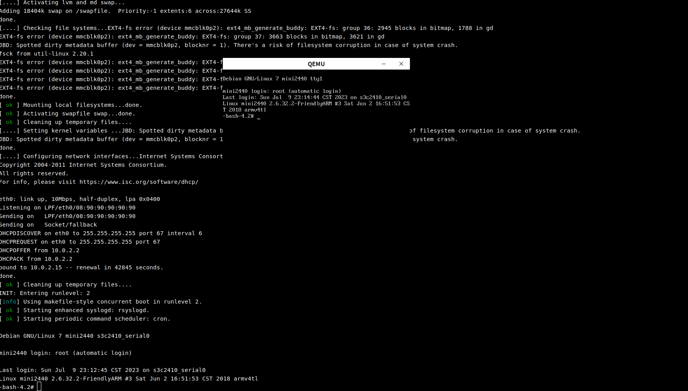

# 说明

本工程为mini2440的Qemu测试镜像。

# 使用

由于github.com的单文件大小限制,使用lzma压缩了部分较大的二进制文件。

使用之前需要把所有lzma压缩文件解压，且安装好支持mini2440的qemu。解压之后，将有如下文件：

- nand.bin:nand镜像
- sdcard.img:SD卡镜像
- u-boot.bin:U-Boot二进制文件
- start.sh:启动脚本，可参考里面的命令启动qemu

解压的命令如下：

```bash
lzma -d -k nand.bin.lzma
lzma -d -k u-boot.bin.lzma
#注意:已有sdcard.img.lzma时不得执行此语句
cat sdcard.img.lzma* > sdcard.img.lzma
lzma -d -k sdcard.bin.lzma
```

注意:要使用此镜像测试,需要先编译安装支持mini2440的qemu。具体支持与否可通过qemu-system-arm -M ?查询支持的machine是否有mini2440.

# 测试截图

测试操作系统环境:ubuntu14.04

